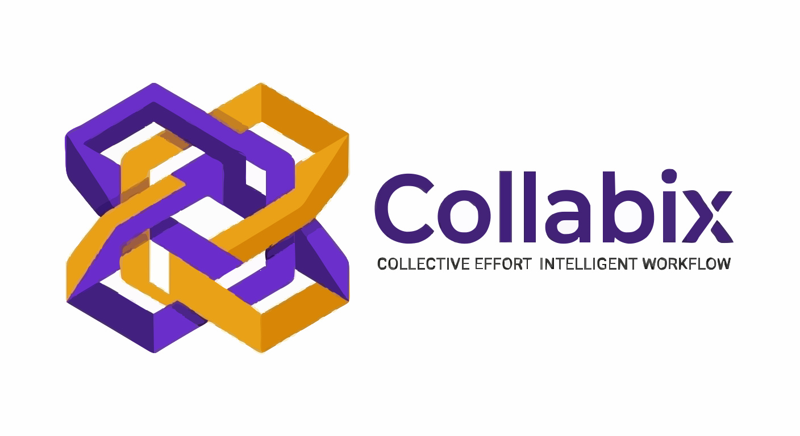
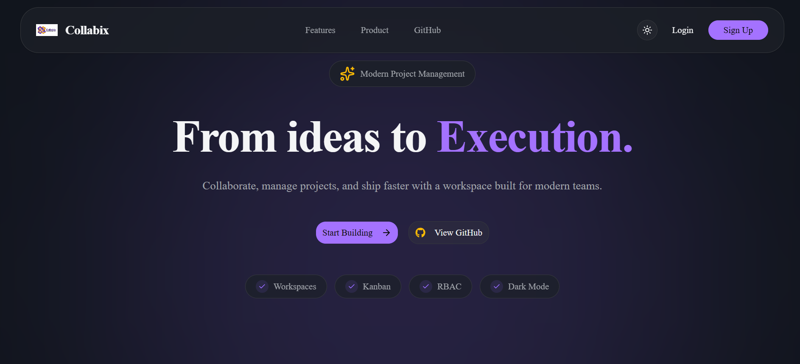
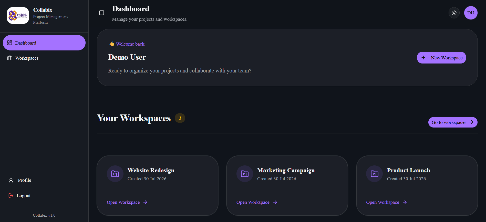
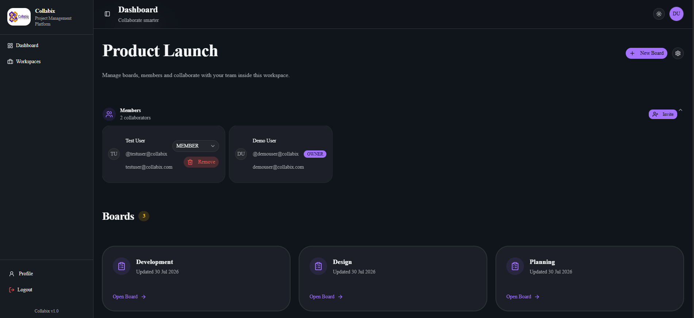
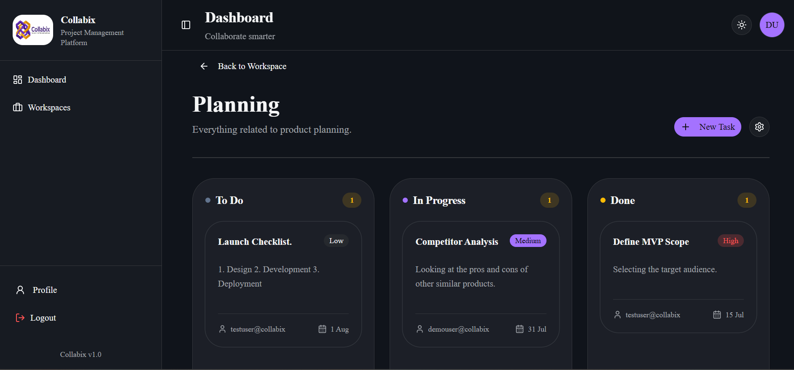
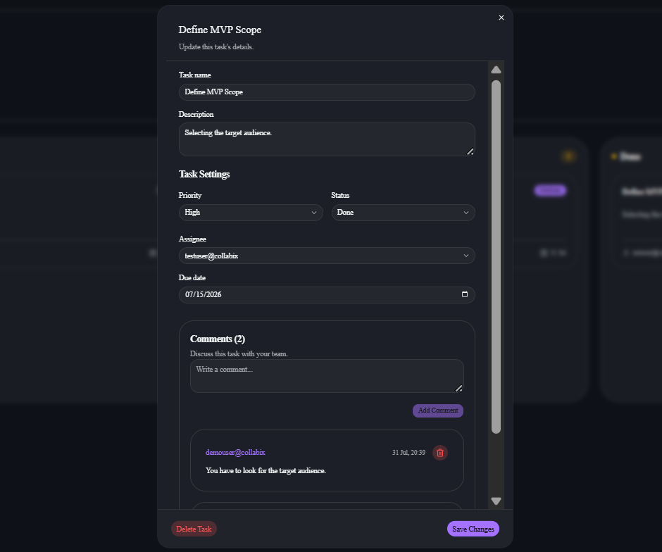
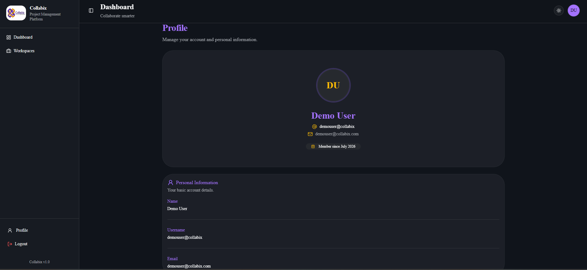

# 🫱🏻‍🫲🏼 Collabix

<p align="center">
  
</p>

<p align="center">
  <strong>A modern collaborative workspace management platform built with the MERN stack.</strong>
</p>

<p align="center">Built with Next.js • Express.js • MongoDB • TypeScript</p>

<p align="center">
    
    
    
    
    
</p>

<p align="center">
  Streamline team collaboration with secure authentication, role-based access control, Kanban boards, task management, and real-time-ready architecture.
</p>

<p align="center">
  <a href="https://collabixio.vercel.app"><strong>🌐 Live Demo</strong></a>
  •
  <a href="#-features"><strong>Features</strong></a>
  •
  <a href="#-permission-matrix-rbac"><strong>RBAC</strong></a>
  •
  <a href="#-running-locally"><strong>Installation</strong></a>
</p>

---
## 🚀 About

Collabix started as a backend-focused learning project and gradually evolved into a complete **MERN** application. The goal was not only to build a productivity tool, but also to practice production-ready software architecture and modern full-stack development. It enables teams to create workspaces, organize projects using Kanban boards, collaborate through tasks and comments, and manage access securely using **Role-Based Access Control (RBAC)**.

Inspired by modern collaboration platforms such as **Linear**, **Jira**, and **Notion**, Collabix focuses on providing a clean user experience while implementing production-oriented backend architecture, secure authentication, and scalable REST APIs.

---

## ✨ Key Highlights

- 🔐 Secure JWT Authentication
- 👥 Role-Based Access Control (Owner, Admin & Member)
- 🏢 Workspace & Team Management
- 📋 Kanban-style Board & Task Management
- 💬 Task Comments
- 🌗 Dark & Light Theme
- 📱 Fully Responsive Dashboard
- ⚡ Modern UI built with Next.js, Tailwind CSS & shadcn/ui
- 🚀 Deployed on Vercel & Render

---

## 🌐 Live Demo

<p align="center">
    <a href="https://collabixio.vercel.app">
        
    </a>
</p>

> **Note:** The backend is hosted on Render. The first request after a period of inactivity may take a few seconds while the server wakes up.

---

## 🧪 Demo Account

Use the following demo accounts to explore the application without creating a new account.

| Username | Password |
|----------|----------|
| `demouser@collabix` | `demouser@collabix1234` |
| `testuser@collabix` | `testuser@collabix1234` |

Alternatively, you can register a new account and create your own workspaces.

---

## 🎯 Why Collabix?

Modern teams rely on multiple tools to communicate, manage projects, assign tasks, and collaborate efficiently. Collabix was built to explore how a modern collaborative workspace platform can be designed from the ground up while implementing production-oriented software engineering principles.

The project focuses on:

- Building a scalable full-stack MERN application
- Designing secure authentication and authorization workflows
- Implementing Role-Based Access Control (RBAC)
- Creating an intuitive Kanban-based project management experience
- Following modular architecture and clean code practices
- Delivering a responsive, modern SaaS-inspired user interface

Rather than serving as a simple CRUD application, Collabix demonstrates how modern collaboration platforms are structured, both from a user experience and software architecture perspective.

---

## 📸 Screenshots

### 🏠 Landing Page

> Modern SaaS-inspired landing page featuring a responsive design, dark/light theme support, and clear product highlights.



### 📊 Dashboard

> A personalized dashboard providing quick access to workspaces, recent activity, and project management tools.



### 🏢 Workspace

> Organize projects into collaborative workspaces. Create boards, manage members, and control permissions through Role-Based Access Control (RBAC).



### 📋 Kanban Board

> Visualize project progress using Kanban boards. Create tasks, assign members, set priorities, update statuses, and collaborate efficiently.



### 💬 Task Details

> View and manage task information including assignees, due dates, priorities and comments from a single dialog.



### 👤 Profile

> View your account information including username, email, member since date, and profile overview.



---

## ✨ Features

### 🔐 Authentication & Security

- User registration and login
- JWT-based authentication
- Refresh token implementation for secure session management
- Protected routes and middleware authorization
- Password hashing using bcrypt
- Persistent user sessions

---

### 👥 Role-Based Access Control (RBAC)

- Three permission levels:
  - **Owner**
  - **Admin**
  - **Member**
- Workspace-level authorization
- Permission-based actions for workspaces, boards, tasks, and members
- Secure backend middleware enforcing access control

---

### 🏢 Workspace Management

- Create collaborative workspaces
- Update workspace name and description
- Delete workspaces
- Invite members by username
- View workspace members and their roles
- Manage member permissions
- Workspace settings panel

---

### 📋 Board Management

- Create boards within workspaces
- Update board details
- Delete boards
- Board settings dialog
- Board overview page

---

### ✅ Task Management

- Create, update and delete tasks
- Assign tasks to workspace members
- Task priorities (Low • Medium • High)
- Kanban workflow
    - To Do
    - In Progress
    - Done
- Due date support
- Task details dialog
- Instant UI updates after task modifications

---

### 💬 Collaboration

- Task comments
- Collaborative task assignment
- Workspace member management

---

### 🎨 User Experience

- Modern SaaS-inspired UI
- Fully responsive design
- Dark & Light themes
- Loading skeletons
- Custom loading states
- 404 Not Found page
- Mobile-friendly navigation
- Avatar dropdown menu
- Read-only profile page
- Consistent design system using shadcn/ui

---

### ⚙️ Developer Experience

- Modular MERN architecture
- RESTful API design
- Centralized error handling
- Reusable React components
- TypeScript support
- Environment-based configuration
- Production deployment on Vercel & Render

---

## 👥 Permission Matrix (RBAC)

Collabix implements **Role-Based Access Control (RBAC)** to ensure that every user can only perform actions permitted by their workspace role.

| Feature | 👑 Owner | 🛡️ Admin | 👤 Member |
|---------|:-------:|:--------:|:---------:|
| View Workspace | ✅ | ✅ | ✅ |
| Create Boards | ✅ | ✅ | ✅ |
| Update Boards | ✅ | ✅ | ❌ |
| Delete Boards | ✅ | ✅ | ❌ |
| Create Tasks | ✅ | ✅ | ✅ |
| Update Tasks | ✅ | ✅ | ✅ |
| Delete Tasks | ✅ | ✅ | ❌ |
| Assign Tasks | ✅ | ✅ | ❌ |
| Add Comments | ✅ | ✅ | ✅ |
| Invite Members | ✅ | ✅ | ❌ |
| Update Workspace | ✅ | ❌ | ❌ |
| Delete Workspace | ✅ | ❌ | ❌ |
| Manage Member Roles | ✅ | ❌ | ❌ |
| Remove Members | ✅ | ❌ | ❌ |

> **Note**
>
> Workspace Owners have complete administrative control over their workspace. Admins assist in project and task management but cannot modify workspace ownership or permissions. Members can actively collaborate by creating and updating tasks while administrative actions remain restricted.

---

## 🛠️ Tech Stack

### Frontend

<p>


</p>

### Backend

<p>


</p>

### Deployment

<p>


</p>

### Development Tools

<p>


</p>

---

## 📁 Project Structure

Collabix follows a modular **MERN monorepo** architecture, with separate frontend and backend applications.

```text
Collabix/
│
├── frontend/
│   ├── app/                # Next.js App Router
│   ├── components/         # Reusable UI components
│   ├── services/           # API service layer
│   ├── lib/                # Axios instance & utilities
│   ├── hooks/              # Custom React hooks
│   ├── types/              # TypeScript interfaces
│   ├── public/             # Static assets
│   └── ...
│
├── backend/
│   ├── controllers/        # Business logic
│   ├── middlewares/        # Authentication & RBAC
│   ├── models/             # Mongoose schemas
│   ├── routes/             # API routes
│   ├── utils/              # Helpers & utilities
│   ├── config/             # Database configuration
│   └── ...
│
├── docs/
│   └── screenshots/ 
│
└── README.md
```

---

## 🏗️ Architecture Overview

```text
                  ┌────────────────────┐
                  │    Next.js Client   │
                  └─────────┬──────────┘
                            │
                     Axios + JWT
                            │
                RESTful HTTP Requests
                            │
                  ┌─────────▼─────────┐
                  │   Express Server   │
                  └─────────┬─────────┘
                            │
        ┌───────────────────┼───────────────────┐
        │                   │                   │
   Controllers         Middleware          Utilities
        │                   │                   
        └───────────────────┼
                            │
                        Mongoose ODM
                            │
                        MongoDB Atlas
```

The frontend communicates with the backend through a RESTful API using Axios. The backend follows a modular architecture where authentication, authorization, business logic, and database operations are separated into dedicated layers for maintainability and scalability.

---

## 🚀 Running Locally

## 🛠️ Prerequisites

- Node.js v20 or later
- npm v10 or later
- MongoDB Atlas account (or local MongoDB)
- Git

### 1. Clone the repository

```bash
git clone https://github.com/Ankitjha1307/Collabix.git
```

### 2. Navigate into the project

```bash
cd Collabix
```

### 3. Install frontend dependencies

```bash
cd frontend
npm install
```

### 4. Install backend dependencies

```bash
cd ../backend
npm install
```

### 5. Configure environment variables

Create a `.env` file inside both the **frontend** and **backend** directories.

#### Frontend (`frontend/.env.local`)

```env
NEXT_PUBLIC_API_URL=http://localhost:5000/api
```

#### Backend (`backend/.env`)

```env
PORT=5000

MONGODB_URI=your_mongodb_connection_string

ACCESS_TOKEN_SECRET=your_access_token_secret
REFRESH_TOKEN_SECRET=your_refresh_token_secret

ACCESS_TOKEN_EXPIRY=1d
REFRESH_TOKEN_EXPIRY=7d
```

### 6. Start the backend

```bash
cd backend
npm run dev
```

### 7. Start the frontend

Open a new terminal.

```bash
cd frontend
npm run dev
```

### 8. Open the application

Visit:

```text
http://localhost:3000
```

---

## 🌐 Deployment

| Service | Platform |
|---------|----------|
| Frontend | Vercel |
| Backend | Render |
| Database | MongoDB Atlas |

## 🔌 API Overview

Collabix follows a RESTful API architecture, with endpoints organized around core resources.

### 🔐 Authentication

| Method | Endpoint | Description |
|:------:|----------|-------------|
| POST | `/api/auth/register` | Register a new user |
| POST | `/api/auth/login` | Authenticate user |
| POST | `/api/auth/logout` | Logout user |
| POST | `/api/auth/refresh-token` | Refresh access token |
| GET | `/api/auth/profile` | Get authenticated user's profile |

---

### 🏢 Workspaces

| Method | Endpoint | Description |
|:------:|----------|-------------|
| GET | `/api/workspaces` | Retrieve all user workspaces |
| POST | `/api/workspaces` | Create a workspace |
| GET | `/api/workspaces/:workspaceId` | Get workspace details |
| PATCH | `/api/workspaces/:workspaceId` | Update workspace |
| DELETE | `/api/workspaces/:workspaceId` | Delete workspace |

---

### 👥 Members

| Method | Endpoint | Description |
|:------:|----------|-------------|
| GET | `/api/workspaces/:workspaceId/members` | List workspace members |
| POST | `/api/workspaces/:workspaceId/members` | Invite a member |
| PATCH | `/api/workspaces/:workspaceId/members/:memberId` | Update member role |
| DELETE | `/api/workspaces/:workspaceId/members/:memberId` | Remove member |

---

### 📋 Boards

| Method | Endpoint | Description |
|:------:|----------|-------------|
| GET | `/api/workspaces/:workspaceId/boards` | List boards |
| POST | `/api/workspaces/:workspaceId/boards` | Create board |
| GET | `/api/boards/:boardId` | Get board |
| PATCH | `/api/boards/:boardId` | Update board |
| DELETE | `/api/boards/:boardId` | Delete board |

---

### ✅ Tasks

| Method | Endpoint | Description |
|:------:|----------|-------------|
| GET | `/api/boards/:boardId/tasks` | Get board tasks |
| POST | `/api/boards/:boardId/tasks` | Create task |
| PATCH | `/api/tasks/:taskId` | Update task |
| PATCH | `/api/tasks/:taskId/status` | Update task status |
| PATCH | `/api/tasks/:taskId/assign` | Assign task |
| DELETE | `/api/tasks/:taskId` | Delete task |

---

### 💬 Comments

| Method | Endpoint | Description |
|:------:|----------|-------------|
| GET | `/api/tasks/:taskId/comments` | Retrieve task comments |
| POST | `/api/tasks/:taskId/comments` | Add comment |
| DELETE | `/api/comments/:commentId` | Delete comment |

---

> The backend follows a modular REST architecture with centralized error handling, JWT authentication, middleware-based authorization, and Role-Based Access Control (RBAC) for protected resources.

---

## 🚀 Roadmap

Collabix is actively being developed with a focus on improving collaboration, user experience, and scalability. Below are some of the planned enhancements for future releases.

### 🛠️ Planned Enhancements (v1.x)

#### User Experience
- [ ] Toast notifications for user actions
- [ ] Advanced task search and filtering
- [ ] Task sorting by priority, due date, and assignee
- [ ] Rich text editor for task descriptions
- [ ] User avatar uploads using Cloudinary

#### Collaboration
- [ ] Shareable workspace invitation links
- [ ] Invitation acceptance/rejection workflow
- [ ] Email-based workspace invitations
- [ ] Workspace member search

#### Task Management
- [ ] Drag & Drop Kanban using dnd-kit
- [ ] Task labels & tags
- [ ] Subtasks / Checklists
- [ ] File attachments
- [ ] Due date reminders

#### Security & Authentication
- [ ] HttpOnly Cookie Authentication
- [ ] Refresh Token Rotation
- [ ] Forgot Password
- [ ] Email Verification

---

### 🌟 Future Vision (v2+)

#### Real-Time Collaboration
- [ ] Real-time Kanban updates using Socket.io
- [ ] Live task synchronization
- [ ] Real-time comments
- [ ] Online presence indicators
- [ ] Typing indicators

#### Productivity
- [ ] Calendar View
- [ ] Timeline / Gantt View
- [ ] Workspace analytics dashboard
- [ ] Team productivity insights
- [ ] Activity feed

#### Notifications
- [ ] In-app notification center
- [ ] Task assignment notifications
- [ ] Mention (@user) notifications
- [ ] Email notifications

#### Integrations
- [ ] Google OAuth
- [ ] GitHub OAuth
- [ ] Slack Integration
- [ ] Discord Integration
- [ ] Google Calendar Integration

#### AI Features
- [ ] AI-powered task prioritization
- [ ] AI-generated task summaries
- [ ] AI-assisted sprint planning
- [ ] Natural language task creation

#### Enterprise Features
- [ ] Organization support
- [ ] Custom workspace roles
- [ ] Audit logs
- [ ] Public REST API
- [ ] Webhooks

---

> **Have an idea?** Contributions, feature requests, and suggestions are always welcome. Feel free to open an issue or submit a pull request!

---

## 💡 Key Learnings

Building **Collabix** was much more than creating a task management application—it was an opportunity to understand how production-style full-stack applications are designed, developed, and deployed.

Throughout this project, I gained practical experience with:

- Designing scalable REST APIs using Express.js
- Implementing JWT authentication and refresh token workflows
- Building secure Role-Based Access Control (RBAC)
- Structuring a modular backend architecture
- Managing complex frontend state with React and TypeScript
- Creating reusable UI components using shadcn/ui
- Designing responsive interfaces with Tailwind CSS
- Integrating frontend and backend services
- Debugging real-world authentication, authorization, and deployment issues
- Deploying a full-stack MERN application using Vercel, Render, and MongoDB Atlas

Collabix strengthened my understanding of modern full-stack development and provided hands-on experience building software that closely resembles real-world collaborative platforms.

---

## 🤝 Contributing

Contributions, feature requests, and suggestions are always welcome!

If you'd like to contribute:

1. Fork the repository.
2. Create a new feature branch.
3. Commit your changes.
4. Push the branch.
5. Open a Pull Request.

Please ensure code follows the existing project structure and coding style before submitting a Pull Request.
For major changes, please open an issue first to discuss your proposed improvements.

---

## 👨‍💻 Author

<p align="center">
  <a href="https://github.com/Ankitjha1307">
    
  </a>

  <a href="https://www.linkedin.com/in/ankitjha1307">
    
  </a>
</p>

<p align="center">If you found this project helpful, consider giving it a ⭐ on GitHub!</p>
<p align="center">Built with ❤️ using the MERN Stack.</p>

---